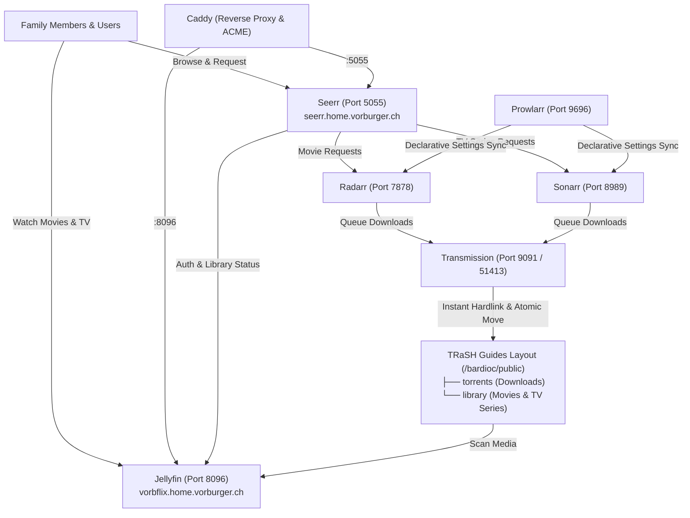

# Nixarr & Seerr

The `services.nixarr` service module provides an automated media management and request stack on NixOS using [Nixarr](https://nixarr.com), [Seerr](https://seerr.dev), and the Servarr ecosystem, following [TRaSH Guides](https://trash-guides.info/) storage layout principles.

## Architecture Overview



### 1. Web UI: Seerr ([seerr.dev](https://seerr.dev))

**Seerr** (formerly Jellyseerr / Overseerr) provides a clean, user-friendly discovery and request interface:

- **Family Experience:** Family members log in using their existing Jellyfin accounts (or local accounts). They can explore trending media, view trailers and ratings, and click **Request**.
- **Automated Workflow:** Once requested (and approved, or auto-approved for family), Seerr dispatches the request to Radarr for movies or Sonarr for TV shows.
- **Reverse Proxy:** Accessible via HTTPS at `https://seerr.home.vorburger.ch` proxied through Caddy.

### 2. TRaSH Guides Storage & Hardlinks ([trash-guides.info](https://trash-guides.info))

To avoid duplicating disk space and prevent slow cross-device file copying, [TRaSH Guides](https://trash-guides.info/) recommends placing downloads and the media library on the **same filesystem mount**:

- On `titan`, the single large ZFS dataset is `bardioc/public` (mounted at `/bardioc/public`).
- Nixarr organizes data into:
  - `/bardioc/public/torrents/` (in-progress and completed downloads).
  - `/bardioc/public/library/` (organized media: `movies/` and `shows/`).
- When a torrent finishes downloading, Radarr or Sonarr creates an **instant hardlink** into the library folder. The file remains in `torrents/` for continuous seeding while simultaneously appearing in the media library for Jellyfin, taking up **zero additional disk space**.

### 3. Servarr Stack

- **[Jellyfin](https://vorbflix.home.vorburger.ch/)
- **[Seerr](https://seerr.home.vorburger.ch/)
- **[Radarr](http://localhost:7878) (Port 7878):** Tracks, searches, and organizes movie releases.
- **[Sonarr](http://localhost:8989/) (Port 8989):** Tracks, searches, and organizes TV series and episodes.
- **[Prowlarr](http://localhost:9696/) (Port 9696):** Centralized torrent indexer manager.
- **[Transmission](http://localhost:9091/transmission/web/) (Port 9091 / 51413):** BitTorrent download client.

### 4. Declarative Settings Sync

Nixarr provides declarative synchronization between services on boot:

- `prowlarr.settings-sync.enable-nixarr-apps = true`: Automatically connects Sonarr and Radarr as applications in Prowlarr.
- `sonarr.settings-sync.transmission.enable = true`: Pre-configures Transmission as the download client in Sonarr.
- `radarr.settings-sync.transmission.enable = true`: Pre-configures Transmission as the download client in Radarr.

---

## Configuration

Enable the stack on a host (e.g. `titan.nix`):

```nix
services.nixarr.enable = true;
```

Default settings applied by `services.nixarr`:

```nix
nixarr = {
  enable = true;
  mediaDir = "/bardioc/public";
  stateDir = "/var/lib/nixarr";
  mediaUsers = [ "vorburger" ];

  seerr.enable = true;
  radarr.enable = true;
  sonarr.enable = true;
  prowlarr.enable = true;
  transmission.enable = true;
};
```

### Reverse Proxy (Caddy)

Caddy automatically provisions TLS certificates via Google Cloud DNS ACME:

- `https://vorbflix.home.vorburger.ch` &rarr; Jellyfin (`:8096`)
- `https://seerr.home.vorburger.ch` &rarr; Seerr Web UI (`:5055`)

---

## State Management & Backups

Understanding the difference between **live state** and **backups** in this architecture:

### 1. Live State (`/var/lib/nixarr`)

All active runtime data is stored on the fast NVMe root drive under `/var/lib/nixarr`:

| Service          | Live Location                  | Persistent State & Files                                                                                                                     |
| :--------------- | :----------------------------- | :------------------------------------------------------------------------------------------------------------------------------------------- |
| **Seerr**        | `/var/lib/nixarr/seerr`        | `db/db.sqlite3` (users, media requests, approvals, notifications), `settings.json` (server config & Jellyfin API credentials)                |
| **Radarr**       | `/var/lib/nixarr/radarr`       | `radarr.db` (movies, root folders, quality profiles, tags, history), `config.xml` (API key, auth), `MediaCover/` (artwork cache)             |
| **Sonarr**       | `/var/lib/nixarr/sonarr`       | `sonarr.db` (TV series, episodes, root folders, profiles, history), `config.xml` (API key, auth), `MediaCover/` (artwork cache)              |
| **Prowlarr**     | `/var/lib/nixarr/prowlarr`     | `prowlarr.db` (indexers, sync state, app connections), `config.xml` (API key, auth)                                                          |
| **Transmission** | `/var/lib/nixarr/transmission` | `settings.json` (bandwidth, ports), `torrents/*.torrent` (metadata for active torrents), `resume/*.resume` (seeding progress & piece hashes) |
| **Jellyfin**     | `/var/lib/jellyfin`            | `data/jellyfin.db` (media libraries, playback watch status, users), plugins, transcodes, config                                              |

### 2. Automated Hot Backups to ZFS (`/bardioc/services/nixarr`)

The `services.backup` module runs daily backups from the fast NVMe live state to the redundant ZFS pool `bardioc`. It performs two complementary steps:

1. **Online SQLite Hot Backup (`.backup`)**: Safely locks and snapshots the active SQLite databases into `<destDir>/db/` without needing to stop any running service:
   - `radarr.db`
   - `sonarr.db`
   - `prowlarr.db`
   - `db.sqlite3` (Seerr)
2. **File Tree Mirroring via `rsync`**: Synchronizes all other non-database files into `<destDir>/files/` (while excluding the live SQLite database and WAL/SHM sidecars to prevent corruption):
   - XML configuration files (`config.xml`)
   - JSON settings (`settings.json`)
   - Transmission active torrent files (`torrents/*.torrent`) and resume states (`resume/*.resume`)
   - Artwork caches (`MediaCover/`)

### 3. ZFS Dataset Setup for Backups

Just like `bardioc/services/jellyfin`, the Nixarr backup destination uses a dedicated ZFS dataset with legacy mount management:

```bash
# Create dataset for Nixarr backup destination
sudo zfs create -p bardioc/services/nixarr

# Set mountpoint to legacy so systemd mounts it automatically
sudo zfs set mountpoint=legacy bardioc/services/nixarr

# Ensure the mount point directory exists (if /bardioc/services has the immutable attribute +i, toggle it)
sudo chattr -i /bardioc/services
sudo mkdir -p /bardioc/services/nixarr
sudo chattr +i /bardioc/services
```

---

## Initial Setup Checklist

After the initial deployment:

1. **Access Radarr Web UI:**
   - Navigate to <http://localhost:7878>.
   - Choose _Authentication Method:_ `Forms (Login Page)`
   - Choose _Authentication Required:_ `Disabled for Local Addresses` (as this is just a localhost-only service anyway)
   - Set a Username & Password
   - Navigate to <http://localhost:7878/settings/general> and note Radarr's _API Key_
   - Navigate to <http://localhost:7878/settings/mediamanagement> and _Add Root Folder_ `/bardioc/public/library/movies`
   - Navigate to <http://localhost:7878/settings/downloadclients> and _Add Download Client_ and choose `Transmission` (on port 9091)
1. **Access Sonarr Web UI:**
   - Navigate to <http://localhost:8989>.
   - Choose _Authentication Method:_ `Forms (Login Page)`
   - Choose _Authentication Required:_ `Disabled for Local Addresses` (as this is just a localhost-only service anyway)
   - Set a Username & Password
   - Navigate to <http://localhost:8989/settings/general> and note Sonarr's _API Key_
   - Navigate to <http://localhost:8989/settings/mediamanagement> and _Add Root Folder_ `/bardioc/public/library/shows`
   - Navigate to <http://localhost:8989/settings/downloadclients> and _Add Download Client_ and choose `Transmission` (on port 9091)
1. **Configure Jellyfin Libraries:**
   - Navigate to <https://vorbflix.home.vorburger.ch> (or <http://localhost:8096>) &rarr; **Dashboard** &rarr; **Libraries**.
   - Under **Movies**: click the three dots &rarr; **Manage Folders**, ensure `/bardioc/public/library/movies` is added, and verify **Enable real time monitoring** is checked.
   - Under **TV Series** (or **Shows**): click the three dots &rarr; **Manage Folders**, add `/bardioc/public/library/shows`, and verify **Enable real time monitoring** is checked.
     _(With real-time monitoring enabled, Jellyfin's inotify watcher automatically refreshes libraries whenever Radarr or Sonarr downloads or hardlinks new media.)_
1. **Access Prowlarr Web UI:**
   - Navigate to <http://localhost:9696>.
   - Choose _Authentication Method:_ `Forms (Login Page)`
   - Choose _Authentication Required:_ `Disabled for Local Addresses` (as this is just a localhost-only service anyway)
   - Set a Username & Password
   - Navigate to <http://localhost:9696> and _Add New Indexer,_ add e.g. a _"Bay"_, or filter by Protocol `torrent`, Privacy `Public`, Categories `Movie` + `TV`
   - If needed (optional), navigate to <http://localhost:9696/settings/indexers> to add preferred torrent _Indexer Proxies_
     (Nixarr's `settings-sync` will automatically sync indexers to Radarr and Sonarr.)
1. **Access Seerr Web UI:**
   - Navigate to <https://seerr.home.vorburger.ch>, choose _Jellyfin._
   - Enter Jellyfin URL: `http://localhost:8096`.
   - Enter your Jellyfin administrator credentials to link libraries and users.
   - Navigate to _Users_ and _Import Jellyfin Users_
1. **Connect Radarr & Sonarr in Seerr:**
   - In Seerr Settings &rarr; **Radarr**: add server (`http://localhost:7878`), enter the API key from Radarr, and select default root folder and quality profile (e.g. `HD-1080p`).
   - In Seerr Settings &rarr; **Sonarr**: add server (`http://localhost:8989`), enter the API key from Sonarr, and select default root folder and quality profile.
1. **Pin Seerr in Jellyfin (Optional):**
   - In Jellyfin Dashboard &rarr; **General** &rarr; **Custom Links**, add a link:
     - Name: `Request Movies & Shows`
     - URL: `https://seerr.home.vorburger.ch`

---

## Troubleshooting & Diagnostics

### 1. Prefer `journalctl` Over `/var/lib/...` Directory Inspection

State directories for services like Jellyfin (`/var/lib/jellyfin/`) and Nixarr (`/var/lib/nixarr/`) are restricted (`0700`) to their respective service daemon users. Attempting to inspect files or logs directly under `/var/lib/...` via `sudo` can trigger hardware security keys (e.g. YubiKey via PAM U2F) or biometric prompts, which will hang or time out in automated or remote terminal sessions.

Instead, always prefer `journalctl`, which members of the `wheel` group can run directly **without `sudo`**:

```bash
# Jellyfin server logs
journalctl -u jellyfin -n 50 --no-pager

# Seerr request management logs
journalctl -u seerr -n 50 --no-pager

# Sonarr & Radarr logs
journalctl -u sonarr -n 50 --no-pager
journalctl -u radarr -n 50 --no-pager

# Transmission BitTorrent client logs
journalctl -u transmission -n 50 --no-pager
```

### 2. Diagnosing Missing Media in Jellyfin (Inotify & Real-Time Monitoring)

Jellyfin uses Linux `inotify` via its `LibraryMonitor` subsystem to detect newly imported media automatically. If newly downloaded movies or series exist in `/bardioc/public/library/` but do not show up in Jellyfin:

1. **Verify active directory watchers**:

   ```bash
   journalctl -b -u jellyfin --grep="LibraryMonitor" --no-pager
   ```

   Check the output to ensure that every library folder is explicitly listed under `Watching directory ...`:

   ```text
   Watching directory /bardioc/public/library/movies
   Watching directory /bardioc/public/library/shows
   ```

   If a folder is missing, it has not been registered in Jellyfin (**Dashboard** &rarr; **Libraries** &rarr; **Manage Folders**). Even manual library scans on a collection will not pick up media from unregistered paths.

2. **Verify inotify event triggers**:
   When Radarr or Sonarr creates a hardlink for a downloaded file, Jellyfin should log a refresh event within seconds:

   ```text
   LibraryMonitor: movies (/bardioc/public/library/movies) will be refreshed.
   ```

3. **Check last completed library scan**:
   ```bash
   journalctl -b -u jellyfin --grep="Scan Media Library" --no-pager
   ```

### 3. Diagnosing Seerr Sync & "View in Jellyfin" Links

Seerr polls Jellyfin and Servarr periodically to reconcile media requests with library availability:

1. **Check Seerr's Jellyfin sync job**:

   ```bash
   journalctl -u seerr --grep="Jellyfin Sync" -n 30 --no-pager
   ```

   If a title has not been scanned by Jellyfin yet, Seerr will not see it during its sync and cannot display the "View in Jellyfin" button.

2. **Check download tracking in Sonarr/Radarr**:
   ```bash
   journalctl -u seerr --grep="Download Tracker" -n 30 --no-pager
   ```
   This confirms that Seerr successfully sees the completed download in Sonarr/Radarr and is waiting for Jellyfin's index to match it.

### 4. Hardlink & Storage Verification

To confirm that Sonarr or Radarr properly created hardlinks under the TRaSH Guides layout without cross-filesystem copies:

```bash
# Check files in library
ls -la /bardioc/public/library/shows/
ls -la /bardioc/public/library/movies/

# Check inode match between torrents and library (hardlink confirmation)
ls -i "/bardioc/public/library/shows/<Show>/<Episode>.mkv"
ls -i "/bardioc/public/torrents/<TorrentFolder>/<Episode>.mkv"
```
